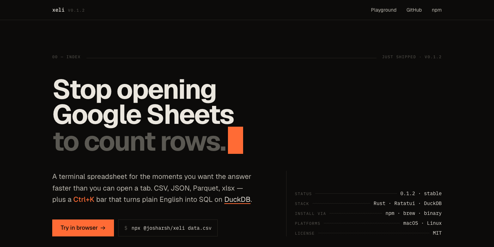

# xeli

**Excel for the terminal.** An interactive TUI spreadsheet with natural language queries.

[](https://github.com/josharsh/xeli/releases/latest)
[](https://www.npmjs.com/package/@josharsh/xeli)
[](LICENSE)
[](https://github.com/josharsh/xeli/actions/workflows/release.yml)
[](https://github.com/josharsh/xeli/stargazers)

Open CSV, JSON, Parquet, and Excel files in a fast TUI spreadsheet. Filter, sort, pivot, and export visually. Ask questions in plain English and let `xeli` write the SQL.

<p align="center">
  
</p>

## Try it without installing

→ **[xeli.vercel.app/playground](https://xeli.vercel.app/playground)**

DuckDB-WASM in your browser. Drop a CSV, ask a question, nothing leaves the tab.

## Install

```bash
# npm (one-off, no install)
npx @josharsh/xeli examples/employees.csv

# npm (global)
npm install -g @josharsh/xeli

# Homebrew
brew install josharsh/tap/xeli
```

Or grab a [prebuilt binary](https://github.com/josharsh/xeli/releases/latest).

Supported on macOS (Apple Silicon, Intel) and Linux (arm64, x86_64). Windows isn't supported yet, see [#help-wanted](CONTRIBUTING.md#open-help-wanted).

## Quick start

```bash
xeli sales.csv             # open a CSV
xeli data.parquet          # or Parquet, JSON, JSONL, Excel
cat events.json | xeli     # pipe anything
psql -c "..." | xeli       # query results, browsable
xeli                       # no args opens a file picker for the current dir
```

Press `Ctrl+K` and ask something:

* *"top 10 employees by salary"*
* *"average revenue by city for active customers"*
* *"signups per week last quarter"*

`xeli` sends your schema plus the question to OpenAI or Anthropic, runs the returned SQL on DuckDB, and shows the rows.

<p align="center">
  
</p>

## Features

| | |
|---|---|
| **Multi-format** | CSV, TSV, JSON, JSONL, Parquet, xlsx |
| **AI queries** | `Ctrl+K`, plain English to SQL via OpenAI or Anthropic |
| **SQL mode** | `Ctrl+Q`, direct DuckDB queries with history |
| **Filter** | `f`, visual builder with 12 operators (`=`, `>`, `contains`, `regex`, ...) |
| **Sort** | `s`, cycle current column ASC / DESC / off |
| **Search** | `/`, regex across all columns, `n` and `N` to walk matches |
| **Group-by + pivot** | `g`, multi-column grouping wizard with `COUNT`, `SUM`, `AVG`, `MIN`, `MAX` |
| **Join** | `J`, pick a second file, choose `INNER` / `LEFT` / `RIGHT` / `FULL` |
| **Computed columns** | `c`, derive new columns from expressions (`price * qty`) |
| **Formula bar** | `=`, one-shot expressions (`SUM(amount)`, `MEDIAN(salary)`) |
| **Histograms** | `v`, sparkline distribution for any numeric column |
| **Column stats** | `Ctrl+I`, min / max / mean / median / nulls / unique count |
| **Export** | `e`, write filtered result back out as CSV / JSON / Parquet |
| **Themes** | `t`, Dracula, Nord, Catppuccin, Tokyo Night, Solarized |
| **Command palette** | `Ctrl+P`, fuzzy-search every command |
| **Undo** | `u`, full view-state stack |
| **File picker** | run `xeli` with no args for a fuzzy list of supported files in cwd |
| **Mouse** | click, scroll, drag to resize columns |

Full keybinding list lives in the in-app help (`?`) or in [src/handlers/input.rs](src/handlers/input.rs).

## How is this different from VisiData / csvkit / xsv / sc-im?

They're all great. Here's how `xeli` finds its niche:

| Tool | Best for | What `xeli` does differently |
|---|---|---|
| **[VisiData](https://www.visidata.org/)** | Mature, scriptable Python TUI | DuckDB engine plus an AI natural-language query layer |
| **[csvkit](https://csvkit.readthedocs.io/)** | Pipeline transforms | Interactive browsing instead of one-shot scripts |
| **[xsv](https://github.com/BurntSushi/xsv)** | Blazing fast CSV processing | Multi-format (Parquet, JSON, xlsx) plus TUI plus SQL |
| **[Miller](https://miller.readthedocs.io/)** | Streaming transforms across formats | Interactive table, group-by wizard, joins by point-and-click |
| **[sc-im](https://github.com/andmarti1424/sc-im)** | Classic spreadsheet UX | Less Excel-cell-editing, more "browse + query large data" |
| **[q](https://harelba.github.io/q/)** | SQL over CSVs from the shell | Same idea, plus a TUI, plus NL queries, plus more file formats |

If you live in a notebook for ad-hoc data exploration, `xeli` is the "I just want to look at this CSV without spinning up Python" tool.

## AI setup

`xeli` works without AI. Every feature except `Ctrl+K` runs offline. To turn natural language queries on, set an API key:

```bash
# OpenAI
export OPENAI_API_KEY=sk-...
# or: xeli config set-key openai sk-...

# Anthropic (Claude)
export ANTHROPIC_API_KEY=sk-ant-...
# or: xeli config set-key anthropic sk-ant-...
```

If you press `Ctrl+K` with no key set, `xeli` walks you through it inline. Pick a provider, paste your key, hit Enter. No restart needed.

## Examples

Sample datasets live in [`examples/`](examples/):

```bash
xeli examples/employees.csv      # 30 rows x 7 columns
xeli examples/departments.csv    # join target
xeli examples/employees.json     # same data, JSON
```

Try this in the AI bar (`Ctrl+K`):

* `top 3 highest-paid people in engineering`
* `average salary by department, ordered by amount`
* `who has been here the longest in each city?`

Or join two files (`J`):

1. Open `examples/employees.csv`
2. Press `J`, enter `examples/departments.csv`
3. Pick `INNER` join, both on the `department` column

## Building from source

```bash
cargo build --release
./target/release/xeli examples/employees.csv
```

Tests (release mode is required on macOS):

```bash
cargo test --release
```

## Tech stack

* **Rust**. Single static binary, ~3k LOC, no runtime dependencies.
* **[Ratatui](https://ratatui.rs/)** for the terminal UI.
* **[DuckDB](https://duckdb.org/)** as the embedded vectorized SQL engine.
* **[clap](https://docs.rs/clap)** for CLI parsing.
* **[tokio](https://tokio.rs/)** as the async runtime for the one AI request.

## Demo

A short, deterministic walk-through. Open a CSV, navigate, sort by salary, then run the group-by wizard for `AVG(salary)` per department.

<p align="center">
  
</p>

## Contributing

PRs welcome. See [CONTRIBUTING.md](CONTRIBUTING.md) for the build and test loop and the open help-wanted list (Windows, Ollama backend, streaming, themes).

## License

MIT. See [LICENSE](LICENSE).
